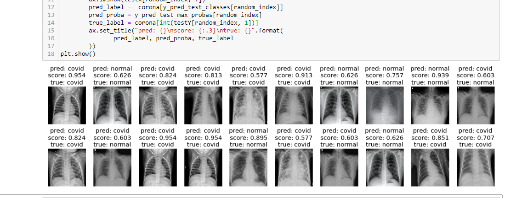

# COVID-19-Detection
Detection of COVID-19 on X-RAY Images using pretrained InceptionV3 model

I speacially thanks to Dr. Adrian Rosebrock for providing the python scripts of COVID-19 detection and Dr Joseph Paul Cohen for providing X-ray images of COVID-19.
- [Detecting COVID-19 in X-ray images with Keras, TensorFlow, and Deep Learning by Dr. Adrian Rosebrock](https://www.pyimagesearch.com/2020/03/16/detecting-covid-19-in-x-ray-images-with-keras-tensorflow-and-deep-learning/)
- [COVID-19 image data collection by Dr Joseph Paul Cohen](https://github.com/ieee8023/covid-chestxray-dataset)

> Note : As Dr. Adrian Rosebrock has stated in his blog "This blog post on automatic COVID-19 detection is for educational purposes only. It is not meant to be a reliable, highly accurate COVID-19 diagnosis system, nor has it been professionally or academically vetted."

### Objective
The aim of this task to detect COVID-19 in X-ray images. There are 25 images of COVID-19 positive and 25 imags of COVID-19 negative (normal). Therefore, total 50 images. As, Data is so small the accuracy may be inconsistant that is, I got 100% accuracy on training and 92% accuracy on validation but your accuracy may not be same due to small dataset. 

### Approach
I used pretrained InceptionV3 model with 'imagenet' weight along with fine tuning the model. We have to resize the image to 299x299 pixels to pass into the InceptionV3 model. 

### Output
20 Random samples of testing example

### Prerequisite
- Python 3.6/3.7
- Keras
- Tensorflow
- OpenCv

